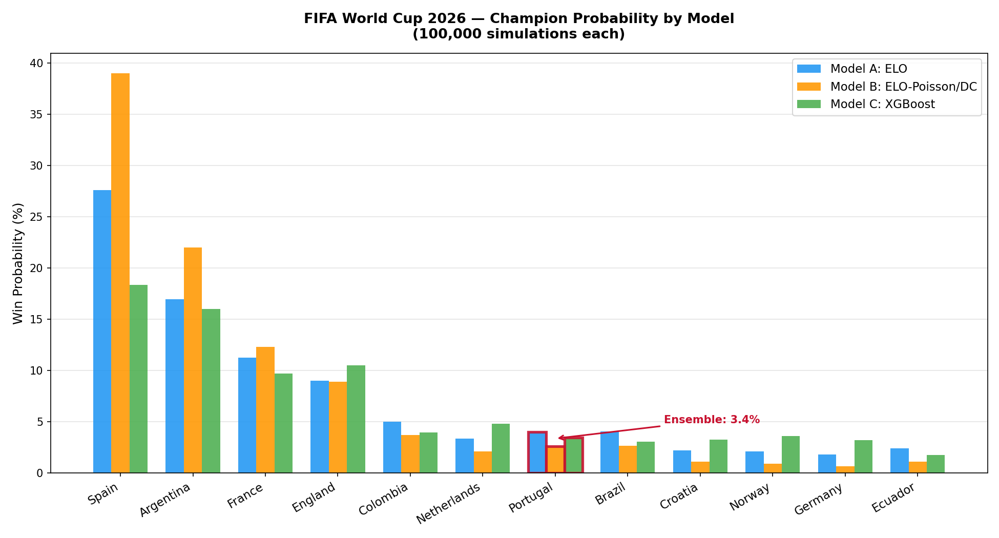
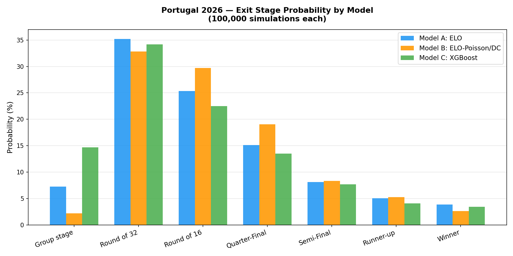
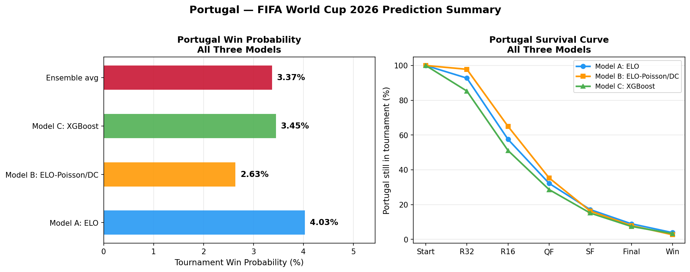
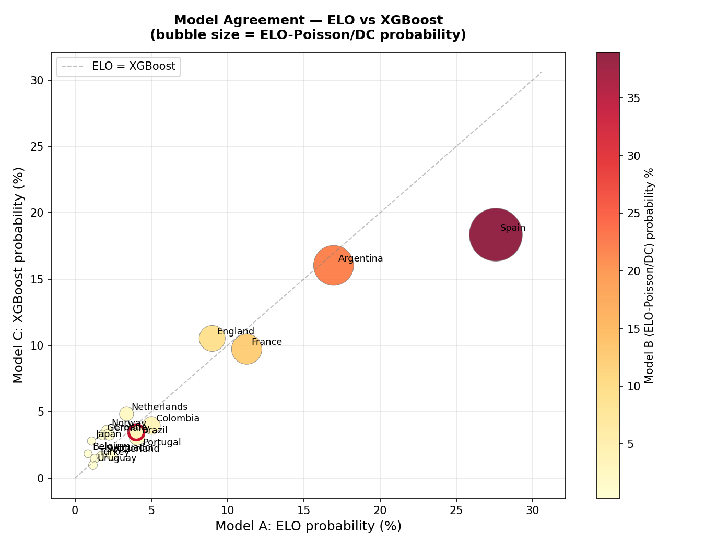

# Portugal WC2026 Win Probability

Three independent models estimate the probability of Portugal winning the FIFA World Cup 2026, combined into a Monte Carlo ensemble.

**Analyst:** Abdul Mussavir | **Date:** May 2026

---

## Result

| Model | Portugal | Spain | Argentina | France |
|---|---|---|---|---|
| A — ELO Simulation | **4.03%** | 27.6% | 17.0% | 11.3% |
| B — ELO-Poisson/DC | **2.53%** | 39.4% | 22.0% | 12.2% |
| C — XGBoost | **3.45%** | 18.3% | 16.0% | 9.7% |
| **Ensemble** | **~3.3%** | ~28.4% | ~18.3% | ~11.1% |

Portugal is a ~30-to-1 dark horse — credible, not a favourite.



---

## How It Works

**48 teams. 100,000 Monte Carlo simulations per model. Three completely different approaches.**

### Model A — ELO Simulation
Uses current ELO ratings to compute win probability for each match, then simulates the full bracket.  
Formula: `E = 1 / (1 + 10^((Rating_B - Rating_A) / 400))`

### Model B — ELO-Poisson / Dixon-Coles
Converts ELO ratings into expected goals, simulates full scorelines via Poisson distribution, with a Dixon-Coles low-score correction (rho = −0.107). A pure Dixon-Coles MLE approach was tested but produced unrealistic results (Iran 31% champion) due to regional goal record inflation — ELO-calibrated Poisson was used instead.

### Model C — XGBoost Classifier
Trained on ~32,000 international matches (2000–2025). Features: ELO diff, form index, head-to-head win rate, average goals scored/conceded, tournament stage, squad market value, and neutral ground flag.

---

## Portugal's Path



All three models agree: **Round of 32 is Portugal's most likely exit point (~33–35%).**  
Portugal qualifies from Group K comfortably (~87–98% group advance) but faces a tough R32 draw.

**Group K:** Portugal 1976 ELO · Colombia 1998 · Uzbekistan 1735 · DR Congo 1616



---

## Model Agreement



Where models agree: Portugal 2.5–4.0%, Spain dominant, Argentina and France in 2nd–4th tier.  
Where they diverge: Spain's range is 18–39% — XGBoost flattens ELO dominance by weighting recent form.

---

## Project Structure

```
src/              Python modules (elo.py, dixon_coles.py, features.py, simulation.py)
notebooks/        Jupyter notebooks — one per phase (EDA → Feature Eng → Models)
data/raw/         Small CSVs committed. Large datasets from Kaggle (see below).
data/processed/   Cleaned feature tables used for training
simulation/       100k simulation results per model (CSV)
models/           Trained XGBoost + Logistic model files + DC parameters
outputs/charts/   All visualisations
tests/            Regression tests
```

---

## Setup

```bash
pip install pandas numpy scipy scikit-learn xgboost matplotlib seaborn plotly jupyter statsmodels
```

### Download large datasets (Kaggle)

These files are excluded from the repo due to size. Place them in `data/raw/`:

| File | Source |
|---|---|
| `international_results.csv` | [martj42/international-football-results](https://www.kaggle.com/datasets/martj42/international-football-results-from-1872-to-2017) |
| `elo_ratings.csv` | [saifalnimri/world-football-elo-ratings](https://www.kaggle.com/datasets/saifalnimri/world-football-elo-ratings) |

```bash
kaggle datasets download -d martj42/international-football-results-from-1872-to-2017 -p data/raw --unzip
```

---

## Run the Models

```bash
# ELO simulation (Phase 4)
jupyter notebook notebooks/04_model_elo.ipynb

# ELO-Poisson/DC simulation (Phase 5)
python src/run_phase5.py

# XGBoost simulation (Phase 6)
python src/run_phase6.py

# Final comparison charts + report (Phase 7)
python src/run_phase7.py
```

---

## Limitations

- Bracket is an approximation of the official FIFA 2026 R32 slot pairings — may slightly understate Portugal's probability
- ELO ratings snapshot as of late 2025; pre-tournament form not captured
- No injury model — Ronaldo availability not modelled
- England/Spain/France Transfermarkt squad values are manually estimated

---

*Built with Python, scikit-learn, XGBoost, SciPy, and 100,000 simulations.*
